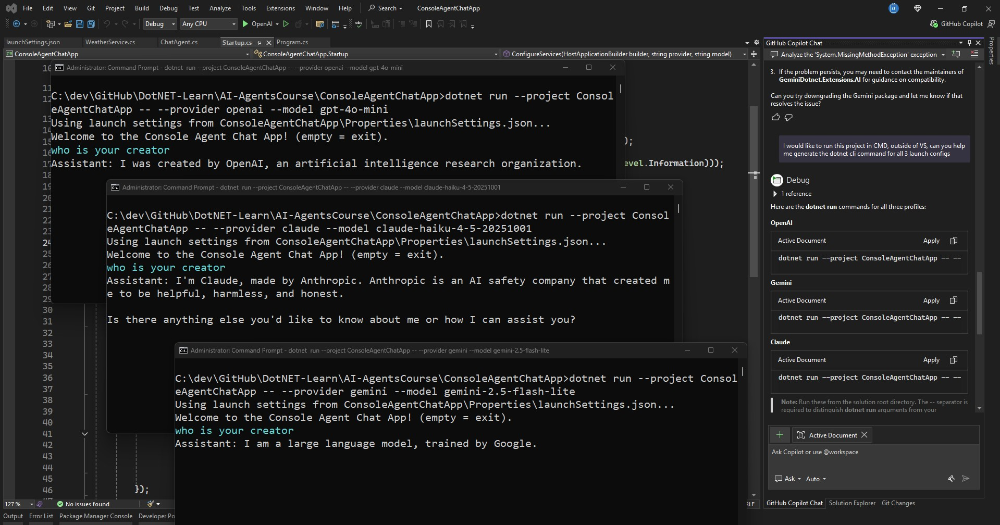

# AI Agents in C#

**Course:** [AI Agents in C#](https://dometrain.com/course/getting-started-ai-agents-in-csharp/)

I undertook this course to learn how to build robust and scalable AI agents using C#. The course covers a wide range of topics, from the basics of setting up an AI agent to advanced concepts like natural language processing, machine learning integration, and agent orchestration.
Towards the end, we explored creating an SDK for the AI agents using Refit.
Finally, we migrated the entire AI agent system to use Minimal APIs.

I followed along with the course instructor, implementing each feature step-by-step. At the same time, I made sure to take notes and note down important code snippets for future reference. I hope this documentation will be helpful for others looking to learn about building AI agents with C#.

I highly recommend this course to anyone interested in backend development with .NET, it provides a solid foundation for building AI agent services!

So, here we go!

## Sneak Peek: Final Working Solution

PENDING

## Use Microsoft.Extensions.AI to Build AI Agents in C#

[Microsoft.Extensions.AI](https://www.nuget.org/packages/Microsoft.Extensions.AI)

For ChatGPT, Gemini, and Anthropic, we can use the Microsoft.Extensions.AI library to create simple CLI chat agents.

### OpenAI (ChatGPT)

[Microsoft.Extensions.AI.OpenAI](https://www.nuget.org/packages/Microsoft.Extensions.AI.OpenAI)

```csharp
"openai" => new OpenAI.Chat.ChatClient(
    model,
    Environment.GetEnvironmentVariable("OPENAI_API_KEY")!
).AsIChatClient(),
```

### Gemini

[GeminiDotnet.Extensions.AI](https://www.nuget.org/packages/GeminiDotnet.Extensions.AI)

```csharp
"gemini" => new GeminiChatClient(
    new GeminiDotnet.GeminiClientOptions()
    {
        ApiKey = Environment.GetEnvironmentVariable("GEMINI_API_KEY")!,
        ModelId = model,
    }
),
```

### Anthropic (Claude)

[Anthropic.SDK](https://www.nuget.org/packages/Anthropic.SDK)

```csharp
"claude" => new AnthropicClient(new APIAuthentication(
            Environment.GetEnvironmentVariable("CLAUDE_API_KEY")!)).Messages,
```



Learning ongoing...